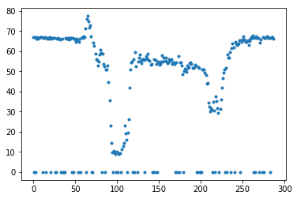
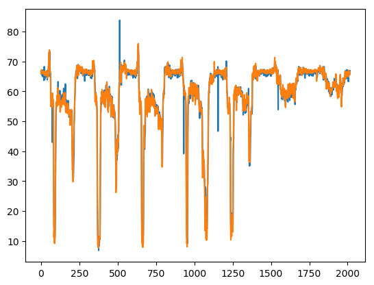
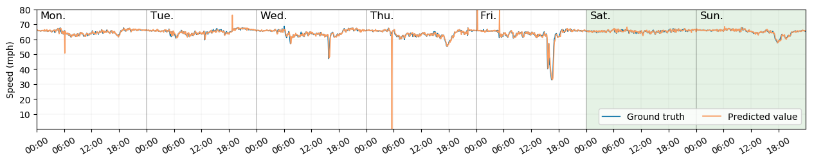
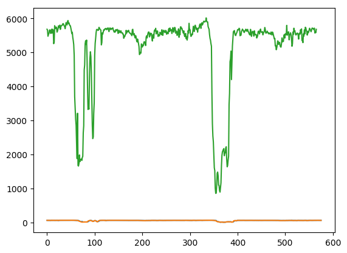

```python
import torch.utils.data as utils
import torch.nn.functional as F
import torch
import torch.nn as nn
from torch.autograd import Variable
from torch.nn.parameter import Parameter
import math
import numpy as np
import pandas as pd
import time
import pickle
import os

import matplotlib.pyplot as plt
import matplotlib.patches as patches

dtype = torch.float32
if torch.cuda.is_available():
    device = torch.device("cuda:1")
else:
    device = torch.device("cpu")

torch.cuda.set_device(1)
```


```python
import matplotlib.pyplot as plt
%matplotlib inline  
```


```python
import sys
sys.path.append('../')
```


```python
import models
import utils
import importlib
```

# Load data


```python
def loadDataset(dataset = None):
    if dataset == 'PEMS-BAY':
        speed_matrix = pd.read_hdf('../Data/PEMS-BAY/pems-bay.h5')
        A = pd.read_pickle('../Data/PEMS-BAY/adj_mx_bay.pkl')
        A = A[2]
        A[np.where(A != 0)] = 1
        for i in range(0, A.shape[0]):
            for j in range(i, A.shape[0]):
                if A[i,j] == 1:
                    A[j,i] = 1
    elif dataset == 'METR-LA':
        speed_matrix = pd.read_hdf('../Data/METR-LA/metr-la.h5')
        A = pd.read_pickle('../Data/METR-LA/adj_mx.pkl')
        A = A[2]
        A[np.where(A != 0)] = 1
        for i in range(0, A.shape[0]):
            for j in range(i, A.shape[0]):
                if A[i,j] == 1:
                    A[j,i] = 1
    elif dataset == 'LOOP-SEA':
        speed_matrix = pd.read_pickle('../Data/LOOP-SEA/speed_matrix_2015_1mph')
        A = np.load('../Data/LOOP-SEA/Loop_Seattle_2015_A.npy')
    else:
        print('Dataset not found.')
        return None, None
    print('Dataset loaded.')
    return speed_matrix, A
```


```python
speed_matrix, A = loadDataset(dataset = 'PEMS-BAY')
```

    Dataset loaded.
    


```python
def GetDataSequence(speed_matrix, \
                   BATCH_SIZE = 64, \
                   seq_len = 10, \
                   pred_len = 1, \
                   train_propotion = 0.7, \
                   valid_propotion = 0.2, \
                   masking = True, \
                   mask_ones_proportion = 0.8):
   
    time_len = speed_matrix.shape[0]
    
    speed_matrix = speed_matrix.clip(0, 100)
    
    max_speed = speed_matrix.max().max()
    speed_matrix =  speed_matrix / max_speed
    
    data_zero_values = np.where(speed_matrix == 0)[0].shape[0]
    data_zero_rate = data_zero_values / (speed_matrix.shape[0] * speed_matrix.shape[1])
    print('orignal dataset missing rate:', data_zero_rate)
    
    np.random.seed(1024)
    Mask = np.random.choice([0,1], size=(speed_matrix.shape), p = [1 - mask_ones_proportion, mask_ones_proportion])
    masked_speed_matrix = np.multiply(speed_matrix, Mask)
    Mask[np.where(masked_speed_matrix == 0)] = 0
    mask_zero_values = np.where(Mask == 0)[0].shape[0] / (Mask.shape[0] * Mask.shape[1])
    print('masked dataset missing rate:', mask_zero_values ,'(mask zero rate:', 1 - mask_ones_proportion, ')')

    speed_sequences, speed_labels = [], []
    for i in range(time_len - seq_len - pred_len):
        speed_sequences.append(masked_speed_matrix.iloc[i:i+seq_len].values)
        speed_labels.append(speed_matrix.iloc[i+seq_len:i+seq_len+pred_len].values)
    speed_sequences, speed_labels = np.asarray(speed_sequences), np.asarray(speed_labels)
    print('speed_sequences, speed_labels, and Mask are generated.')

    # Mask sequences
    Mask = np.ones_like(speed_sequences)
    Mask[np.where(speed_sequences == 0)] = 0

    print('time stamps, time intervals, and last observations are generated.')

    speed_sequences = np.expand_dims(speed_sequences, axis=1)
    Mask = np.expand_dims(Mask, axis=1)
    dataset_agger = np.concatenate((speed_sequences, Mask, Mask, Mask), axis = 1)
        
    return dataset_agger, speed_sequences, speed_labels
```


```python
dataset_agger, speed_sequences, speed_labels = GetDataSequence(speed_matrix, \
                    BATCH_SIZE = 64, \
                    train_propotion = 0.6, \
                    valid_propotion = 0.2, \
                    mask_ones_proportion = mask_ones_proportion)
```

    orignal dataset missing rate: 3.075978438630983e-05
    masked dataset missing rate: 0.19995176440720996 (mask zero rate: 0.19999999999999996 )
    speed_sequences, speed_labels, and Mask are generated.
    time stamps, time intervals, and last observations are generated.
    


```python
importlib.reload(utils)
from utils import PrepareDataset, TrainModel, TestModel
```


```python
importlib.reload(utils)
from utils import PrepareDataset
mask_ones_proportion = 0.8
train_dataloader, valid_dataloader, test_dataloader, max_speed, X_mean = PrepareDataset(speed_matrix, \
                    BATCH_SIZE = 64, \
                    train_propotion = 0.6, \
                    valid_propotion = 0.2, \
                    mask_ones_proportion = mask_ones_proportion)
```

    orignal dataset missing rate: 3.075978438630983e-05
    masked dataset missing rate: 0.19995176440720996 (mask zero rate: 0.19999999999999996 )
    speed_sequences, speed_labels, and Mask are generated.
    time stamps, time intervals, and last observations are generated.
    Start to shuffle and split dataset ...
    [19871 28973 45627 ... 47713  9105  6075]
    Finished
    


```python
importlib.reload(utils)
from utils import TrainModel, TestModel
```


```python
importlib.reload(models)
from models import GNN
importlib.reload(utils)
from utils import TrainModel, TestModel
gnn = GNN(A, layer = 10, gamma = 0.9).cuda()
gnn.load_state_dict(torch.load('./GMN_PEMS-BAY_MR=0.2/GMN10'))
gnn_test = TestModel(gnn, test_dataloader, max_speed)
```

    Tested: MAE: 1.201, RMSE : 2.8299999237060547, MAPE : 2.296 %, 
    


```python
W1 = (gnn.A1 * gnn.W1).cpu().data.numpy()
W2 = (gnn.A2 * gnn.W2).cpu().data.numpy()
W3 = (gnn.A3 * gnn.W3).cpu().data.numpy()
W4 = (gnn.A4 * gnn.W4).cpu().data.numpy()
W5 = (gnn.A5 * gnn.W5).cpu().data.numpy()
W6 = (gnn.A6 * gnn.W6).cpu().data.numpy()
W7 = (gnn.A7 * gnn.W7).cpu().data.numpy()
W8 = (gnn.A8 * gnn.W8).cpu().data.numpy()
W9 = (gnn.A9 * gnn.W9).cpu().data.numpy()
W10 = (gnn.A10 * gnn.W10).cpu().data.numpy()
```


```python
inputs, labels = next(iter(train_dataloader))
[batch_size, type_size, step_size, fea_size] = inputs.size()
```


```python
max_speed = speed_matrix.max().max()
```


```python
inputs.shape
```


    torch.Size([64, 4, 10, 325])


```python
dataset_agger.shape
```


    (52105, 4, 10, 325)


```python
speed_sequences.shape
```


    (52105, 1, 10, 325)


```python
speed_labels.shape
```


    (52105, 1, 325)


```python
dataset_agger[0:1].shape
```


    (1, 4, 10, 325)


```python
x = dataset_agger[0:2]
```


```python
x = torch.tensor(x, dtype = dtype, device = device)
```


```python
day = 16
sensor_idx = 2
plt.plot(dataset_agger[288 * day:288 * (day+1),0,0,sensor_idx] * max_speed, '.')
```


    [<matplotlib.lines.Line2D at 0x259241d91d0>]





```python
dataset_agger[288 * day:288 * (day+1),0,0,sensor_idx].shape
```


    (288,)


```python
dayofyear = 29
num_of_day = 7
pred = []
for i in range(288 * dayofyear, 288 * (dayofyear+num_of_day)):
    x = dataset_agger[i:i+2]
    x = torch.tensor(x, dtype = dtype, device = device)
    output = gnn(x).cpu().data.numpy() * max_speed
    pred.append(output[0])
pred = np.array(pred)
# print(np.array(pred).shape)
plt.plot(pred[:,2], '-')
label = speed_labels[288 * dayofyear:288 * (dayofyear+num_of_day),0] * max_speed
plt.plot(label[:,2])
```


    [<matplotlib.lines.Line2D at 0x2592a65b8d0>]





```python
sensor_list = list(speed_matrix.columns.values)
```


```python
y = label
y_pred = pred
```


```python
sensor_id  = 10
y = label[:, sensor_id] 
y_pred = pred[:, sensor_id] 

plt.style.use('default')
fig = plt.figure(figsize=(13, 2.5))
ax = fig.add_axes([0.05,0.22,0.92,0.75])

plt.plot(y[0:7*288-1],color="#006ea3",linewidth=1,label="Ground truth")
plt.plot(y_pred[0:7*288-1],color="#f79b5f",linewidth=1.2,label=r"Predicted value")
# plt.plot(data[0:14*144-1,3],color="#e3120b",linewidth=1.0,label="Estimated value")
ax.set_xlim([0, 7*288-1])
ax.set_ylim([0, 80])
ax.grid(color='gray', linestyle='-', linewidth=0.1, alpha=0.7)

for i in range(7):
    if i >=5 :
        someX, someY = i*288, 0
        currentAxis = plt.gca()
        ax.add_patch(patches.Rectangle((someX, someY), 288, 80,
                      alpha=0.1, facecolor='green'))

    plt.axvline(x = i * 288 + 1, color='black', linestyle='-', linewidth=0.3, alpha=0.8)

plt.xticks(np.arange(0, 7*288, 72),["00:00", "06:00", "12:00", "18:00",
            "00:00", "06:00", "12:00", "18:00",
            "00:00", "06:00", "12:00", "18:00",
            "00:00", "06:00", "12:00", "18:00",
            "00:00", "06:00", "12:00", "18:00",
            "00:00", "06:00", "12:00", "18:00",
            "00:00", "06:00", "12:00", "18:00"], rotation=30)

plt.yticks(np.arange(10,90,10),[10,20,30,40,50,60,70,80])

dow_x_bias = 10
dow_y = 74

plt.text(288 * 0 + dow_x_bias, dow_y, 'Mon.', fontsize=12)
plt.text(288 * 1 + dow_x_bias, dow_y, 'Tue.', fontsize=12)
plt.text(288 * 2 + dow_x_bias, dow_y, 'Wed.', fontsize=12)
plt.text(288 * 3 + dow_x_bias, dow_y, 'Thu.', fontsize=12)
plt.text(288 * 4 + dow_x_bias, dow_y, 'Fri.', fontsize=12)
plt.text(288 * 5 + dow_x_bias, dow_y, 'Sat.', fontsize=12)
plt.text(288 * 6 + dow_x_bias, dow_y, 'Sun.', fontsize=12)

ax.set_ylabel("Speed (mph)")
plt.legend(ncol=3, loc=4)
plt.show()
fig.savefig('./Figure/PEMS-BAY_sensorID_' + str(sensor_list[sensor_id]) + '_doy_' + str(dayofyear) + 'to' + str(dayofyear+7) + '.png', dpi = 300)
plt.close(fig)
```





```python
# x = dataset_agger[i:i+2]
# x = torch.tensor(x, dtype = dtype, device = device)
# output = gnn(x).cpu().data.numpy() * max_speed
# pred.append(output[0,sensor_idx])
```


```python
# label = speed_labels[288 * day:288 * (day+1),0,2] * max_speed
# plt.plot(label)
```


```python
dayofyear = 29
num_of_day = 1
sensor_idx = 5
pred = []
pred_input = []
# pred_input = []
pred_input_outputs = []
mask = np.expand_dims(np.ones_like(dataset_agger[0:2][:,3,:,:]), axis=1)
for i in range(288 * dayofyear, 288 * (dayofyear+num_of_day) - 144 ):
    x = dataset_agger[i:i+2]
    x = torch.tensor(x, dtype = dtype, device = device)
    output = gnn(x).cpu().data.numpy()
    pred.append(output[0])
    if i < 10:
        pred_input.append(output[0])
    else:
#         pred_input.pop(0)
#         print(np.array(pred_input).shape)
#         print(np.array(mask).shape)
        pred_speed_input = np.concatenate((np.expand_dims(np.array(pred_input), axis=0), np.expand_dims(np.array(pred_input), axis=0)), axis = 0)
#         print(pred_speed_input.shape) 
        pred_speed_input = np.expand_dims(pred_speed_input, axis = 1)
#         print(pred_speed_input.shape)
        pred_input_group = np.concatenate((pred_speed_input, mask, mask, mask), axis = 1)
#         print(pred_speed_input.shape)
        input = torch.tensor(pred_input_group, dtype = dtype, device = device)
        pred_input_output = gnn(input).cpu().data.numpy()
        pred_input = np.concatenate( (pred_input[1:10], pred_input_output[0]), axis=0)
        pred_input_outputs.append(pred_input_output[0])
#     print(output[0,sensor_idx])
pred = np.array(pred)  * max_speed
# print(np.array(pred).shape)
plt.plot(pred[:,sensor_idx])
label = speed_labels[288 * dayofyear:288 * (dayofyear+num_of_day) - 144,0] * max_speed
plt.plot(label[:,sensor_idx])
pred_input_outputs = np.array(pred_input_outputs) * max_speed
plt.plot(pred_input_outputs[:,sensor_idx])
```


    ---------------------------------------------------------------------------

    ValueError                                Traceback (most recent call last)

    <ipython-input-330-a6a6d087459c> in <module>
         22         pred_speed_input = np.expand_dims(pred_speed_input, axis = 1)
         23 #         print(pred_speed_input.shape)
    ---> 24         pred_input_group = np.concatenate((pred_speed_input, mask, mask, mask), axis = 1)
         25 #         print(pred_speed_input.shape)
         26         input = torch.tensor(pred_input_group, dtype = dtype, device = device)
    

    ValueError: all the input arrays must have same number of dimensions


```python
plt.plot(label[:,sensor_idx],label="Ground truth")
plt.plot(pred[:,sensor_idx],label="Predicted")
# dataset_agger[0:0+2][0][0]
pred_pred = np.concatenate( (dataset_agger[0:0+2][0][0] * 0, pred_input_outputs), axis = 0)
plt.plot(pred_pred[:,sensor_idx],label="Predicted Predicted")
plt.legend()
```


    <matplotlib.legend.Legend at 0x2592a85abe0>


```python
dataset_agger[0:0+2][0][0]
```


    array([[0.83901293, 0.79670975, 0.82843713, ..., 0.80846063, 0.83548766,
            0.        ],
           [0.8413631 , 0.79318449, 0.82961222, ..., 0.80376028, 0.8319624 ,
            0.7920094 ],
           [0.        , 0.        , 0.82491187, ..., 0.80376028, 0.        ,
            0.79788484],
           ...,
           [0.82843713, 0.79435958, 0.82961222, ..., 0.80258519, 0.83313749,
            0.79435958],
           [0.84018801, 0.79318449, 0.82843713, ..., 0.80258519, 0.83666275,
            0.80258519],
           [0.83078731, 0.7920094 , 0.        , ..., 0.80258519, 0.        ,
            0.79905993]])


```python
pred_pred = np.concatenate( (dataset_agger[0:0+2][0][0], pred_input_outputs), axis = 0)
```


```python
pred_pred.shape
```


    (576, 325)


```python
pred.shape
```


    (576, 325)


```python
np.arrange(0,10)
```


    ---------------------------------------------------------------------------

    AttributeError                            Traceback (most recent call last)

    <ipython-input-304-ae5f2d208c0b> in <module>
    ----> 1 np.arrange(0,10)
    

    AttributeError: module 'numpy' has no attribute 'arrange'


```python
plt.plot(pred[:,sensor_idx])
plt.plot(label[:,sensor_idx])
pred_input_outputs = np.array(pred_input_outputs) * max_speed
plt.plot(pred_input_outputs[:,sensor_idx])
```


    [<matplotlib.lines.Line2D at 0x25927667470>]





```python
mask = np.ones_like(dataset_agger[0:2][:,3,:,:])
```


```python
mask.shape
```


    (2, 10, 325)


```python

```
